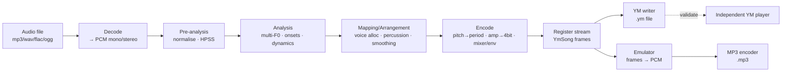
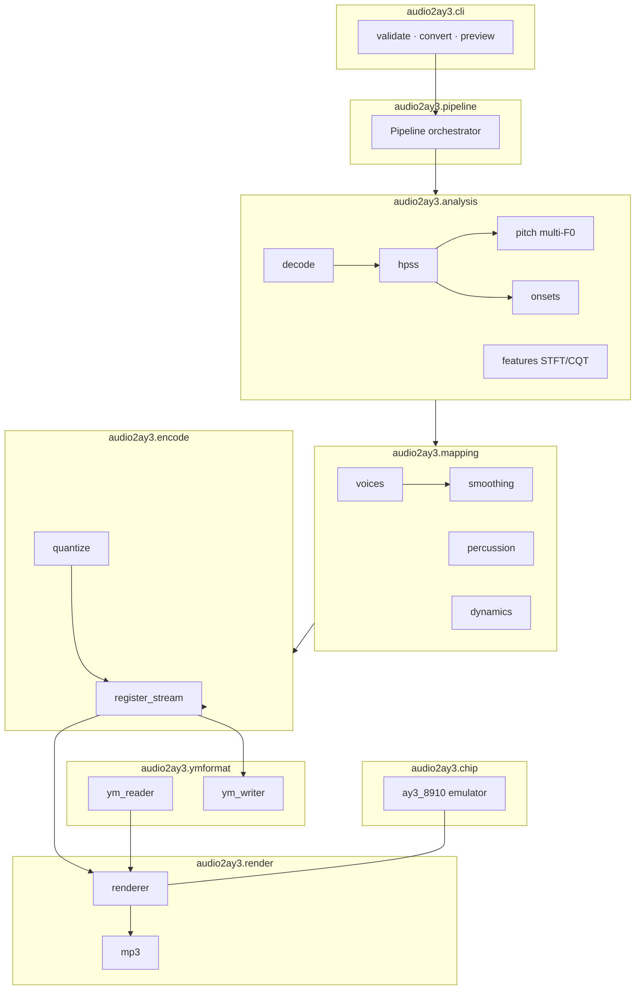

# 04 — System Architecture

## 4.1 Architectural goals

The four qualities the brief demands, made concrete:

| Quality | How the architecture delivers it |
|---------|----------------------------------|
| **Modular** | Each pipeline stage is an independent package with a typed input/output dataclass. Stages communicate only through these contracts, never through globals or hidden state. |
| **Robust** | Every stage validates its inputs and degrades gracefully (e.g., a silent frame still produces legal registers). The chip backend is the *only* thing that emits registers, so legality is enforced in one place. |
| **Testable** | Pure functions where possible; deterministic given a seed. Stage boundaries are mock-friendly. The emulator gives objective, repeatable audio for regression tests. |
| **Maintainable** | One responsibility per module, documented contracts, no post-AY shortcuts that would hide complexity. |

## 4.2 High-level data flow



- **convert** runs A→H.
- **preview** runs A→G→I→J (and may also write the `.ym`).
- **validate** runs (`.ym` reader)→I→J, with no analysis at all.

The **register stream (`YmSong`)** is the pivotal contract: everything left of it is "musical
intelligence," everything right of it is "faithful reproduction." The no-post-processing rule
is simply: *nothing may touch the signal to the right of node I except lossless encoding.*

## 4.3 Module boundaries



### Package responsibilities

| Package | Responsibility | Key types |
|---------|----------------|-----------|
| `audio2ay3.config` | Typed configuration: clock, frame rate, channel budget, GPU toggles, profiles. | `ChipConfig`, `RunConfig` |
| `audio2ay3.analysis` | Turn PCM into a frame-aligned musical description. | `AnalysisResult` |
| `audio2ay3.mapping` | Decide which notes/drums occupy which chip resources over time. | `Arrangement` |
| `audio2ay3.encode` | Quantise the arrangement into legal register frames. | `YmSong` |
| `audio2ay3.chip` | Cycle-accurate-enough AY/YM2149 emulator. | `Ay3Emulator` |
| `audio2ay3.ymformat` | YM read/write + LHA. | `YmSong`, readers/writers |
| `audio2ay3.render` | Emulate `YmSong` → PCM → MP3. | `Renderer` |
| `audio2ay3.pipeline` | Wire stages, manage threading/GPU, progress. | `Pipeline` |
| `audio2ay3.cli` | Argument parsing, UX, exit codes. | — |
| `audio2ay3.utils` | Audio I/O, threading helpers, GPU detection, logging. | — |

## 4.4 Stage contracts (data types)

The contracts matter more than the algorithms; algorithms can be swapped behind them.

```python
# analysis output — everything is frame-aligned to frame_rate
@dataclass
class FramePitches:
    freqs_hz: list[float]      # detected fundamentals, salience-ordered
    saliences: list[float]     # 0..1 confidence/energy per fundamental

@dataclass
class FramePercussion:
    onset: bool
    kind: Literal["kick", "snare", "hat", "tom", "perc", None]
    energy: float              # 0..1

@dataclass
class AnalysisResult:
    frame_rate: int
    n_frames: int
    pitches: list[FramePitches]          # len == n_frames
    percussion: list[FramePercussion]    # len == n_frames
    loudness_db: np.ndarray              # per-frame overall loudness
    meta: dict                           # source sr, duration, separation info

# mapping output — abstract, still pre-quantisation
@dataclass
class ChannelEvent:
    source: Literal["tone", "noise", "tone+noise", "silent"]
    freq_hz: float | None
    amplitude: float                 # 0..1 perceptual, pre-DAC
    use_envelope: bool
    env_shape: int | None
    noise_freq_hz: float | None

@dataclass
class Arrangement:
    frame_rate: int
    n_frames: int
    channels: list[list[ChannelEvent]]   # [A,B,C] each len == n_frames
    noise_period_hint: list[float | None]
    envelope: list[tuple[int, float] | None]  # (shape, freq) per frame, global

# encode output == ymformat.YmSong  (see 03-ym-format-reference.md)
```

Every stage is a pure function of the form `f(input_contract, config) -> output_contract`.
This makes the pipeline trivially testable and reorderable, and lets us A/B alternative
algorithms (e.g., NMF vs CQT multi-F0) by swapping one module.

## 4.5 Proposed repository layout

```
audio2ay3/
├── pyproject.toml              # build + deps (PEP 621), tool config
├── README.md
├── .venv/                      # local environment (not committed)
├── design/                     # THIS folder
├── samples/                    # provided instrumental inputs
│   ├── long/                   # full tracks (mp3)
│   └── short/                  # stems/loops (wav, ogg)
├── build/                      # generated artefacts (gitignored)
├── src/
│   └── audio2ay3/
│       ├── __init__.py
│       ├── cli.py
│       ├── config.py
│       ├── pipeline.py
│       ├── chip/
│       │   ├── ay3_8910.py     # emulator core
│       │   ├── tone.py noise.py envelope.py
│       │   └── volume_tables.py
│       ├── ymformat/
│       │   ├── model.py        # YmSong
│       │   ├── ym_reader.py ym_writer.py lha.py
│       ├── analysis/
│       │   ├── decode.py hpss.py features.py
│       │   ├── pitch.py onsets.py dynamics.py
│       ├── mapping/
│       │   ├── voices.py percussion.py smoothing.py
│       ├── encode/
│       │   ├── quantize.py register_stream.py
│       ├── render/
│       │   ├── renderer.py mp3.py
│       └── utils/
│           ├── audio_io.py threading.py gpu.py logging.py
└── tests/
    ├── unit/                   # per-module
    ├── integration/            # end-to-end on fixtures
    ├── golden/                 # reference YM/byte fixtures
    └── fixtures/               # tiny audio + ym samples
```

`src/` layout (not flat) keeps imports clean, prevents accidental top-level shadowing, and
matches modern Python packaging. See [12-tech-stack-dependencies.md](12-tech-stack-dependencies.md).

## 4.6 Configuration model

A single `RunConfig` threads through the pipeline so behaviour is reproducible and CLI flags
map 1:1 to fields:

```python
@dataclass(frozen=True)
class ChipConfig:
    master_clock_hz: int = 1_773_400
    frame_rate_hz: int = 50
    n_chips: int = 1               # 1 or 2 (dual-AY)
    tone_channels: int = 3         # 3 per chip

@dataclass(frozen=True)
class RunConfig:
    chip: ChipConfig = ChipConfig()
    use_gpu: bool = True           # auto-falls back to CPU
    threads: int = 0               # 0 = auto
    separation: Literal["hpss", "demucs", "spleeter", "none"] = "hpss"
    # note source — DSP frame-F0 OR neural note-event transcription:
    multipitch: Literal[
        "cqt-salience", "nmf", "klapuri",        # DSP frame-F0 (default, deterministic)
        "basic-pitch", "mt3", "onsets-frames",   # neural transcription (note events)
    ] = "cqt-salience"
    render_sr: int = 44_100
    mp3_bitrate_kbps: int = 192
    seed: int = 0                  # determinism
```

Profiles (e.g., `--profile quality` vs `--profile fast`) are just named `RunConfig` presets.

## 4.7 Error handling & boundaries

- **Validate at boundaries only.** Decode, file I/O, and CLI args are the trust boundaries;
  internal stage-to-stage data is assumed well-formed (it is produced by our own typed code).
- **Never emit illegal registers.** `encode.register_stream` is the single choke point that
  clamps and asserts hardware limits (§[02](02-ay-3-8910-reference.md#211-hard-limits-the-encoder-must-enforce)).
- **Fail loud on unsupported input** (e.g., a corrupt audio file) with a clear CLI message and
  non-zero exit code; never write a partial `.ym`.

## 4.8 Extensibility seams (designed-in, not built yet)

- **Note-source backend** is pluggable (`RunConfig.multipitch`): DSP frame-F0 (CQT salience,
  NMF, Klapuri) or neural transcription (Spotify **Basic Pitch**, Google Magenta **MT3** /
  **Onsets & Frames**) — swappable without touching mapping/encode.
- **Separation backend** is pluggable (`RunConfig.separation`): HPSS (default), **Demucs**
  (HT-Demucs), Spleeter.
- **Chip backend** is abstracted so a second PSG (e.g., SN76489) could be added without
  touching analysis/mapping.
- **Chip count / frame rate** are config, enabling dual-AY and 100 Hz (§[11](11-scalability.md)).
