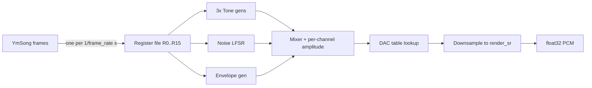
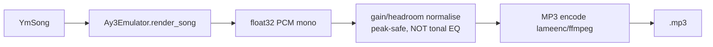

# 05 — Emulator & YM I/O Design (Milestone 1)

This is the **foundational milestone**. Before any conversion work, we build a trusted
playback path so every later decision is measurable. Two deliverables:

1. An **accurate AY-3-8910 / YM2149 emulator** (register frames → PCM).
2. A **YM → MP3** tool (`validate`) that proves the emulator reproduces real tunes.

Once these exist, "does it sound right?" becomes an objective, repeatable question.

## 5.1 Why the emulator comes first

- It is the **ground truth** for the whole project: the same code validates YM files and
  renders previews, so what we measure equals what plays.
- It de-risks the hardest correctness questions (DAC table, noise LFSR, envelope timing)
  *before* we depend on them for fidelity judgements.
- It gives immediate, listenable output from day one using the large public YM corpus.

## 5.2 Emulator architecture



### Two-clock model

- **Chip clock** `f_master` (e.g. 1.7734 MHz) drives the internal generators.
- **Render clock** `render_sr` (44.1/48 kHz) is the audio we output.

We do **not** run one Python step per chip cycle (millions/sec). Instead we use the standard
**fractional-counter** technique: advance each generator's down-counter by the number of chip
cycles per output sample, toggling state on underflow, then optionally oversample + decimate
to control aliasing.

```
cycles_per_sample = f_master / render_sr        # e.g. 1773400/44100 ≈ 40.21
```

### Per-sample algorithm (per output sample)

```
advance tone counters A,B,C by cycles_per_sample (toggle square on underflow)
advance noise counter; clock the 17-bit LFSR on underflow
advance envelope counter; step the 16-level ramp per shape in R13
for c in (A,B,C):
    tone_g  = R7.tone_c_enabled  ? square_c : 1
    noise_g = R7.noise_c_enabled ? lfsr_bit : 1
    level   = R[8+c].use_env ? env_level : R[8+c].level4
    out_c   = DAC[level] * (tone_g & noise_g)
sample = (out_A + out_B + out_C) * headroom
```

### Anti-aliasing

Square and noise edges between sample points cause aliasing. Two acceptable strategies:

1. **Oversample × N** (e.g. ×2–×4) then **decimate** with a polyphase low-pass. Simple,
   robust; the default.
2. **BLEP/BLEP-band-limited steps** for edges — higher quality, more complex. Optional later.

For Milestone 1, oversample ×2 + a good FIR decimator is sufficient and verifiable.

## 5.3 Accuracy requirements

| Element | Requirement | Verification |
|---------|-------------|--------------|
| Tone pitch | `f = f_master/(16·TP)`, `TP=0→1` | Frequency-estimate a rendered single tone; assert <1 cent error mid-range. |
| Noise | 17-bit LFSR, taps 0 & 3, `f = f_master/(16·NP)` | Spectrum matches reference noise colour per NP. |
| Envelope | 16-step ramp, all 8 audible shapes, R13 write re-triggers | Render each shape; compare envelope contour to reference. |
| DAC | Measured non-linear table (§[02](02-ay-3-8910-reference.md#28-dac-volume--amplitude-table)) | Level-vs-RMS curve matches table within tolerance. |
| Mixer | Active-low tone/noise gating, both-on supported | Truth-table unit tests. |
| Mixing | Sum of 3 DACs, no post EQ | Bit-exact summation test. |

**Reference oracles:** ST-Sound (`ym2mp3`/library) and MAME's `ay8910` device. We A/B our
render against at least one on a fixed YM set and keep the diff under a tuned perceptual
threshold (log-spectral distance / simple PEAQ-like metric). See
[10-testing-validation.md](10-testing-validation.md).

## 5.4 Emulator API

```python
class Ay3Emulator:
    def __init__(self, chip: ChipConfig, render_sr: int = 44_100,
                 oversample: int = 2): ...

    def reset(self) -> None: ...

    def render_song(self, song: YmSong) -> np.ndarray:
        """Render a full YmSong to float32 mono PCM at render_sr."""

    def render_frames(self, frames: np.ndarray, master_clock: int,
                      frame_rate: int) -> np.ndarray:
        """Lower-level: render an (n,16) uint8 register array."""

    def step_frame(self, regs: np.ndarray) -> np.ndarray:
        """Render exactly one frame (1/frame_rate s) of PCM. Streaming-friendly."""
```

- Stateless across `render_song` calls (explicit `reset`).
- `step_frame` enables streaming/preview and keeps memory bounded for long tracks.
- Dual-AY (§[11](11-scalability.md)) is two emulator instances summed; the API already takes
  `ChipConfig`, so no signature change.

## 5.5 Performance plan for the emulator

Pure-Python per-sample loops are too slow for minutes of audio. Strategy:

1. **Vectorise with NumPy** where possible (envelope ramp, DAC lookup, mixing).
2. **JIT the hot inner loop** (tone/noise counters) with **Numba** (`@njit`), which handles
   the inherently sequential LFSR/counter updates at C-like speed.
3. Process **frame-by-frame** to keep arrays cache-friendly and enable threading across long
   files (chunks of frames render independently because chip state is carried explicitly).

Target: render ≥ 10× real-time on a modern CPU core; comfortably parallelised across cores.
See [09-performance-acceleration.md](09-performance-acceleration.md).

> The emulator stays **CPU-based** — it is sequential and light; the GPU budget is spent on
> analysis, not emulation.

## 5.6 The `validate` tool (YM → MP3)

```
audio2ay3 validate input.ym -o output.mp3
```

Flow: `ym_reader.load(path)` → `Renderer.render(song)` → `mp3.encode(pcm)`.

- Honours the YM header's `masterClock`/`frameRate` (so Atari 2 MHz tunes and ZX 1.77 MHz
  tunes both play at correct pitch).
- Respects `loopFrame` for a configurable number of loops or a fixed duration
  (`--duration`, `--loops`).
- Supports YM2/3/3b/5/6 and LHA-packed inputs.

This command is both a **user feature** (listen to YM files) and the **acceptance test** for
emulator accuracy.

## 5.7 Render → MP3 path



- The only permitted post-emulation step is **peak-safe gain/dither for encoding** — never
  tonal shaping. This preserves the "no post-AY enhancement" rule (it is the same operation a
  real capture's ADC front-end would need, and does not alter timbre).
- MP3 via `lameenc` (pure-Python binding) or `ffmpeg` subprocess; WAV output also offered for
  lossless inspection (`-o out.wav`).

## 5.8 Milestone-1 acceptance criteria

1. Renders a corpus of public YM2/3/5/6 files to MP3/WAV without errors.
2. Single-tone pitch accuracy < 1 cent (mid register); noise & envelope shapes visually and
   audibly match reference renders.
3. A/B perceptual diff vs ST-Sound/MAME under the agreed threshold on the reference set.
4. `validate` CLI complete with duration/loops options and YM version auto-detect.
5. Deterministic, unit-tested generators (tone/noise/envelope/mixer/DAC).
