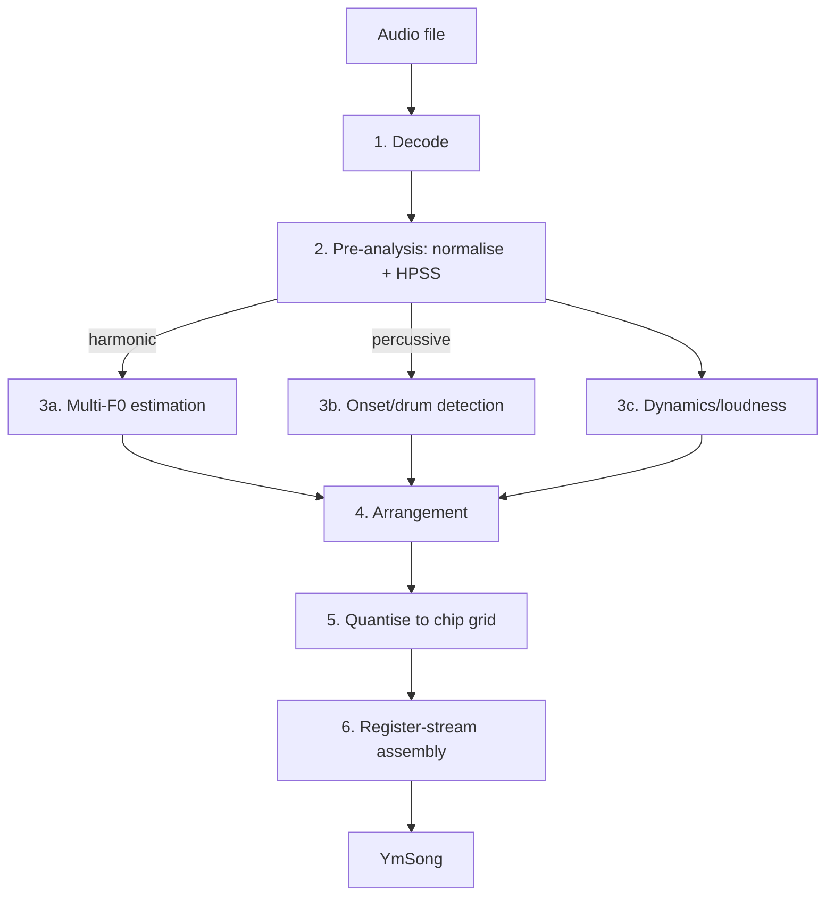

# 06 — Conversion Pipeline (Audio → YM)

This is the heart of the project: turning rich instrumental audio into a 3-tone + 1-noise
register stream. It is deliberately staged so each step is independently testable and
replaceable, and so the research questions ("which multi-pitch method? which voice-allocation
policy?") can be answered by swapping one module at a time.



All stages are **frame-aligned** to the target `frame_rate` (50 Hz → 20 ms hop). The analysis
front-end may use a finer internal hop for accuracy, then resample features to the frame grid.

---

## Stage 1 — Decode

- Decode any supported container (mp3/wav/flac/ogg/…) to float32 PCM via `ffmpeg`/`soundfile`.
- Resample to an internal working rate (44.1 kHz; configurable).
- Mix to mono for pitch analysis, but **retain stereo** for separation/percussion cues that
  benefit from it.
- Emit working buffers + metadata (sr, duration, channel count).

Edge cases: variable sample rate, clipping, DC offset (remove), extreme loudness (normalise to
a known RMS/LUFS target so later thresholds are stable).

---

## Stage 2 — Pre-analysis: normalise + source separation

Two jobs:

1. **Loudness normalisation** to a reference (e.g. −23 LUFS) so onset/salience thresholds are
   content-independent. This is analysis conditioning, not output processing.
2. **Harmonic/Percussive Source Separation (HPSS).** Splits the signal into a *harmonic*
   stream (sustained pitched content) and a *percussive* stream (transients/drums). This is the
   single highest-leverage preprocessing step because the chip handles those two worlds with
   different resources (tone channels vs noise generator).

| Backend | When | Cost |
|---------|------|------|
| **HPSS** (median-filter, librosa-style) | default; fast, deterministic, GPU-friendly via STFT | low |
| **Demucs** (HT-Demucs, 4- or 6-stem NN, Meta) | recommended quality path; SOTA stem isolation (drums/bass/other, opt. guitar/piano) → per-stem analysis | high (GPU) |
| **Spleeter** (TF NN stems) | alternative stems; lighter than Demucs, lower quality | med (GPU/CPU) |

NN stem separation is a research lever, not a requirement, but a powerful one: **Demucs**
(HT-Demucs) cleanly splits the mix into stems, which we can analyse *independently* — e.g. the
bass stem drives the bass channel, the drums stem drives percussion, the *other* stem drives
melody/harmony. Per-stem analysis materially improves voice allocation on dense mixes because
each detector sees one instrument instead of a crowded spectrum. It also pairs naturally with
the neural transcription backends below (transcribe each stem). The architecture allows all of
this without changing downstream stages
(§[04](04-system-architecture.md#48-extensibility-seams-designed-in-not-built-yet)), at
significant compute cost.

---

## Stage 3a — Multi-F0 (polyphonic pitch) estimation

**Goal:** for every 20 ms frame, estimate the set of fundamental frequencies present in the
*harmonic* stream, each with a salience (importance/energy) score.

This is the core research problem. The pipeline supports pluggable estimators
(`RunConfig.multipitch`):

| Method | Idea | Pros | Cons |
|--------|------|------|------|
| **CQT salience** (default) | Constant-Q transform → harmonic salience/pitch-spectrum (sum harmonics) → peak-pick top-K | Log-frequency = musically aligned; GPU-friendly; tunable | Octave/harmonic confusion needs handling |
| **NMF** | Factorise spectrogram into pitched templates + activations | Good for steady timbres; separates overlapping notes | Template/rank tuning; transients weak |
| **Klapuri iterative** | Estimate dominant F0, subtract its harmonics, repeat | Strong classical baseline | Slower; error accumulation |
| **Neural transcription** (Basic Pitch · MT3 · Onsets & Frames) | Learned audio→**note events** (not frame F0); see below | Best musical-information extraction; instrument identity; clean discrete notes | Heavy deps; less deterministic; opt-in |

> **Separation vs transcription — different stages, both useful.** *Separation* (Stage 2,
> Demucs) splits audio into stems. *Transcription* (here) converts audio directly into
> **note events** (onset, offset, pitch, velocity, instrument). The strongest transcribers are
> neural and extract musical information far better than classical DSP on dense polyphony:
>
> - **Basic Pitch (Spotify research).** Lightweight polyphonic transcription with pitch
>   bends → MIDI-like notes. Recommended *default* neural option — small and fast
>   (ONNX/TFLite), easy to deploy.
> - **MT3 (Google Magenta).** Multi-task **multi-instrument** transcription. Emits notes
>   **with instrument/program labels** — uniquely valuable here because it tells voice
>   allocation *what* each note is (bass vs lead vs pad) and even transcribes drums. Heaviest
>   (JAX/T5X + model weights).
> - **Onsets & Frames (Google Magenta).** Strong note-onset transcription (piano-centric,
>   generalises) → precise onsets/offsets.
>
> These output **symbolic note events**, which we **rasterise onto the 20 ms frame grid** to
> produce the same `FramePitches` / `AnalysisResult` contract — so every downstream stage is
> unchanged (§[04](04-system-architecture.md#44-stage-contracts-data-types)). Two concrete
> fidelity wins: (1) discrete notes carry far less frame-to-frame wobble than DSP multi-F0,
> reducing jitter *at the source* (§[07](07-sound-quality-strategy.md#71-jitter-free-output));
> (2) MT3's instrument identity and per-note velocity directly improve **voice allocation** and
> **dynamics mapping**. Trade-off: heavier dependencies and weaker determinism, so the DSP
> estimators remain the lean, reproducible default and the neural path is the recommended
> `--profile quality` (§[12](12-tech-stack-dependencies.md)).

Design choices common to all **DSP** estimators:

- **Salience function** combines harmonic energy (sum/own-product of harmonics) with onset
  emphasis so newly struck notes win attention.
- **Octave-error guard:** prefer the lowest plausible fundamental when a candidate's "harmonics"
  are all explained by a sub-octave; penalise candidates that are exact multiples of a stronger one.
- **Top-K = chip budget + headroom:** detect K≈5–6 candidates per frame even though only 3 tone
  channels exist; the *mapping* stage decides which survive (it needs alternatives for good
  voice-leading).
- **Frequency range** clamped to what the chip renders usefully
  (§[02](02-ay-3-8910-reference.md#pitch-resolution--quantisation-error)); very high content is
  octave-folded down rather than emitted as badly-detuned tones.

Output per frame: `FramePitches(freqs_hz, saliences)` (salience-sorted).

---

## Stage 3b — Onset & percussion detection

Operates on the *percussive* HPSS stream.

- **Onset detection function** (spectral flux / superflux) → peak-pick onsets at frame
  resolution.
- **Drum classification** (kick/snare/hat/tom/other) via band-energy heuristics first
  (kick = low band, hat = high band, snare = broadband + mid), with an optional small
  classifier later. Classification steers noise-period and envelope choices
  (§[07](07-sound-quality-strategy.md#72-percussion)).
- **Optional neural drum transcription.** When a multi-instrument transcriber (MT3) or the
  Demucs *drums* stem is enabled, percussion onsets and kinds come from the model instead of
  heuristics — typically tighter timing and cleaner kick/snare/hat labels — feeding the same
  `FramePercussion` contract.
- Per-frame output `FramePercussion(onset, kind, energy)`.

The single shared noise generator means percussion is **monophonic in noise**: the mapping
stage must arbitrate when two hits collide (e.g., kick+hat) — usually by priority + brief
tone-channel assist.

---

## Stage 3c — Dynamics / loudness

- Per-frame overall loudness and per-source (harmonic vs percussive) energy envelopes.
- Drives amplitude mapping and the "which voice is most important" salience weighting.
- Computed in perceptual units (dB / LUFS-ish) because the DAC is logarithmic
  (§[02](02-ay-3-8910-reference.md#28-dac-volume--amplitude-table)).

Output: `AnalysisResult` (see [04](04-system-architecture.md#44-stage-contracts-data-types)).

---

## Stage 4 — Arrangement (mapping to chip resources)

Transforms the abstract `AnalysisResult` into an `Arrangement`: what each of the 3 tone
channels and the noise/envelope generators do, **per frame**, still in physical units (Hz,
0..1 amplitude) before quantisation.

### 4.1 Voice allocation (the central problem)

We must continuously assign ≤3 of the detected fundamentals to channels A/B/C such that:

- **The most important notes survive** (salience + musical role: bass and melody are weighted
  up; inner harmonies are sacrificed first).
- **Notes stay on the same channel** while sustained (continuity), to avoid retrigger
  artifacts and to keep envelopes coherent.
- **Channel reassignment is minimised** (a cost penalty discourages stealing a channel from a
  still-sounding note).

Formulated as a **frame-to-frame assignment problem**:

```
minimise   Σ assignment_cost(prev_voice_on_channel, candidate_note)
           + Σ stealing_penalty + Σ (importance_of_dropped_notes)
subject to at most 3 active tone channels
```

Solved per frame with the **Hungarian algorithm** (optimal bipartite matching) or a greedy
priority assignment for speed; the cost function encodes pitch continuity (small Δcents = cheap
to keep), salience, and role. A **bass-channel bias** reserves one channel's preference for the
lowest strong fundamental so low end stays present.

### 4.2 Percussion mapping

- Map detected drum hits onto the **noise generator + envelope**, choosing noise period by drum
  kind and using a fast-decay envelope shape (e.g. `0x09 \___`) re-triggered on the hit frame.
- Decide which tone channel "hosts" the noise via the mixer (often channel C), optionally
  layering a short tone component for kick body / snare tone.
- Arbitrate collisions by priority (kick > snare > hat) and by briefly borrowing a tone channel
  when free.

Details and trade-offs in [07-sound-quality-strategy.md](07-sound-quality-strategy.md#72-percussion).

### 4.3 Dynamics mapping

- Convert per-voice perceptual loudness to a 0..1 amplitude per channel (still continuous).
- Apply musical **dynamic range compression into the chip's usable band** (most action in DAC
  levels 8–15). This is legal: it shapes registers, not rendered audio.

### 4.4 Smoothing / jitter control

Applied across frames to the arrangement (not the audio):

- **Note hysteresis & minimum duration:** suppress notes shorter than ~2–3 frames unless a
  clear onset; prevents 1-frame flickers.
- **Pitch debounce:** ignore sub-quantisation pitch wobble; only change `TP` when the target
  period actually changes by ≥1 step *and* persists.
- **Amplitude slew limiting:** cap per-frame volume jumps except on onsets, killing zipper
  noise.
- **Channel-swap damping:** the stealing penalty above plus a short lock-in after reassignment.

This stage is where "stable, jitter-free tonal output" is won
(§[07](07-sound-quality-strategy.md#71-jitter-free-output)).

Output: `Arrangement` (channels × frames of `ChannelEvent`, plus global noise/envelope tracks).

---

## Stage 5 — Quantise to the chip grid

Pure, deterministic conversion from physical units to register values:

| From | To | Rule |
|------|----|------|
| `freq_hz` | 12-bit `TP` | `TP = clamp(round(f_master/(16·f)), 1, 4095)`; octave-fold if out of range |
| `amplitude 0..1` | 4-bit level | nearest-amplitude lookup into the **measured DAC table** (perceptual), not linear |
| `noise_freq_hz` | 5-bit `NP` | `NP = clamp(round(f_master/(16·f)), 1, 31)` |
| `env (shape,freq)` | R13 + 16-bit `EP` | `EP = clamp(round(f_master/(256·16·f)), 1, 65535)` |
| source flags | R7 mixer bits | active-low tone/noise enables |

All clamping/legality lives here and in stage 6 — the **single choke point** for
hardware-legal output. Quantisation error is reported (for diagnostics) but never "fixed" by
post-processing.

---

## Stage 6 — Register-stream assembly

- Build the `(n_frames, 16)` uint8 array, frame by frame, from the quantised arrangement.
- Enforce every hard limit (§[02](02-ay-3-8910-reference.md#211-hard-limits-the-encoder-must-enforce)); assert no
  reserved/effect bits are set.
- Attach metadata (`master_clock`, `frame_rate`, optional `loop_frame`, name/author/comment).
- Produce a `YmSong`, handed to **either** the YM writer (`convert`) **or** the emulator
  (`preview`).

> The output of stage 6 is the project's pivotal contract. Everything upstream is musical
> intelligence; everything downstream is faithful reproduction. The "no post-AY enhancement"
> rule is enforced structurally: there is simply no module between the emulator and the MP3
> encoder that can alter timbre.

---

## 6.x Determinism & diagnostics

- Given the same input + `RunConfig.seed`, the pipeline is **deterministic** (critical for
  regression tests and A/B research).
- Each stage can dump a **debug artefact** (piano-roll of detected pitches, chosen voices,
  per-channel register tracks) for inspection — invaluable when tuning fidelity.
- A `--explain` mode writes these artefacts alongside the output for analysis.
