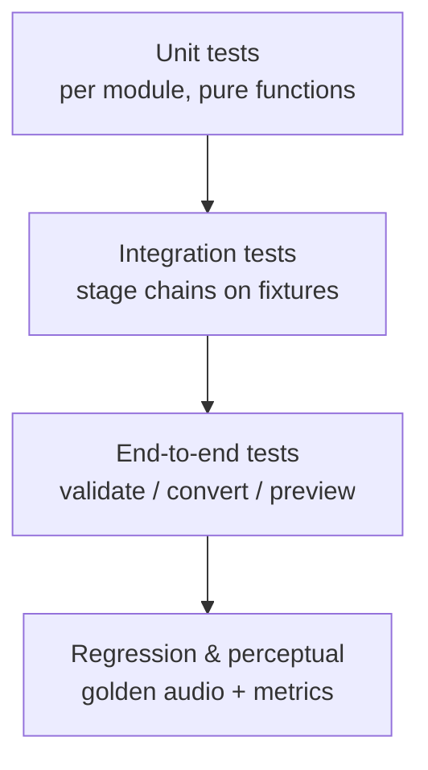
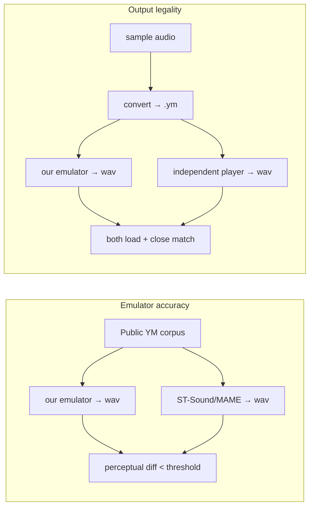

# 10 — Testing & Validation

Testing has two faces here: **conventional software tests** (the system is testable by design)
and a **YM-playback validation workflow** that uses the chip format itself to prove
hardware-faithfulness. The trusted emulator from Milestone 1 makes audio outcomes objective.

## 10.1 Test pyramid

### Unit tests (fast, deterministic)

| Module | Representative tests |
|--------|----------------------|
| `chip/tone` | period→frequency math; `TP=0→1`; edge periods |
| `chip/noise` | LFSR sequence matches reference; period scaling |
| `chip/envelope` | each R13 shape contour; re-trigger on R13 write |
| `chip/volume_tables` | level→amplitude == measured table |
| `chip/ay3_8910` | mixer truth table; both-source gating; silence at level 0 |
| `ymformat/ym_reader` | parse YM2/3/3b/5/6; LHA depack; de-interleave |
| `ymformat/ym_writer` | golden header bytes; round-trip identity |
| `encode/quantize` | freq→TP, amp→level, clamps, octave-fold |
| `encode/register_stream` | no illegal/reserved bits ever emitted |
| `mapping/voices` | assignment continuity; stealing penalty behaviour |
| `mapping/smoothing` | hysteresis/slew limits suppress 1-frame flickers |

### Integration tests

- `analysis → mapping → encode` on tiny synthetic inputs with known content (e.g. a synthesised
  C-major triad → expect three stable tone periods on three channels).
- `ym_writer → ym_reader` round-trip equality of `frames` + metadata.
- `encode → emulator` produces audio whose dominant frequency matches the intended note.

### End-to-end tests

- `validate fixture.ym` renders without error and matches a stored golden WAV within tolerance.
- `convert sample.wav` emits a `.ym` that (a) re-loads in our reader and (b) loads in an
  **independent** player (cross-validation, §10.3).
- `preview sample.wav` produces audio whose onset map aligns with the source's onsets.

## 10.2 Synthetic fixtures (known-answer tests)

Generate deterministic inputs so correctness is unambiguous:

- **Single sine** at known Hz → convert → expect a single channel at the nearest `TP`; measure
  cents error.
- **Triad / chord** → expect three channels, correct pitches, stable over time.
- **Click train** (percussion) → expect noise-generator hits aligned to clicks.
- **Silence** → expect legal all-quiet frames (amplitudes 0), no spurious notes.
- **Pitch glide** → expect monotonic `TP` change with no octave flips (jitter guard).

These run in CI in milliseconds and pin the math/logic precisely.

## 10.3 YM-playback validation workflow (hardware-faithfulness)

This is the brief's "validation workflow leveraging YM playback compatibility." It proves our
output is real-chip-legal, not just internally consistent.

1. **Emulator accuracy (forward):** render a fixed set of public YM2/3/5/6 files with *our*
   emulator and with an *independent* reference (ST-Sound `ym2mp3` and/or MAME `ay8910`).
   Compare with an objective metric (log-spectral distance, or a lightweight perceptual measure)
   and keep the difference under a tuned threshold. This is Milestone 1's gate.
2. **Output legality (cross):** every `.ym` we emit must load and play in at least one
   independent player without error. If a third-party player reproduces it, it is by definition
   hardware-faithful at the register level. Mismatches between our render and theirs flag bugs in
   our writer or emulator.
3. **Round-trip:** `write → read → write` is byte-stable; `frames` survive unchanged.

## 10.4 Perceptual & musical regression metrics

Tracked in CI on the curated `samples/` set to catch quality drift:

| Metric | What it guards | Method |
|--------|----------------|--------|
| **Jitter rate** | warble/zipper | count significant per-frame `TP`/level changes on sustained notes; must stay below a baseline |
| **Onset alignment** | drum timing | IoU/offset between source onsets and emitted noise-hit frames (±1 frame) |
| **Melody recall** | tune correctness | where a reference transcription exists, compare emitted top-voice pitch contour |
| **Loudness stability** | pumping | per-frame loudness variance within bounds |
| **Legality** | hardware safety | assert zero out-of-range/reserved register writes (hard fail) |

Golden audio renders are stored for key fixtures; CI fails if the new render diverges beyond
tolerance (with an easy "bless" step to update goldens on intentional changes).

## 10.5 Tooling & CI

- **pytest** for all tiers; `pytest-xdist` for parallel runs.
- **Coverage** gate on the pure-logic packages (chip, ymformat, encode, mapping).
- **Determinism check:** run a conversion twice with a fixed seed; assert byte-identical `.ym`.
- **CI matrix:** CPU-only job (no GPU) must pass fully — GPU is an accelerator, never a
  correctness dependency.
- **Lint/type:** `ruff` + `mypy` on `src/` keep contracts honest.

## 10.6 Manual listening protocol

Automated metrics can't fully judge "musicality." A lightweight human protocol:

1. Convert the standard set with the candidate profile.
2. Blind A/B previews vs. the previous profile.
3. Score recognisability, stability, percussion solidity (1–5).
4. Record scores next to the profile; only promote a profile if it doesn't regress any axis.

## 10.7 Reference test assets

- A small, redistribution-safe set of public-domain YM files (for emulator accuracy).
- The provided `samples/` (instrumental) for conversion/perceptual tests.
- Synthetic fixtures generated on the fly (no storage, fully deterministic).
